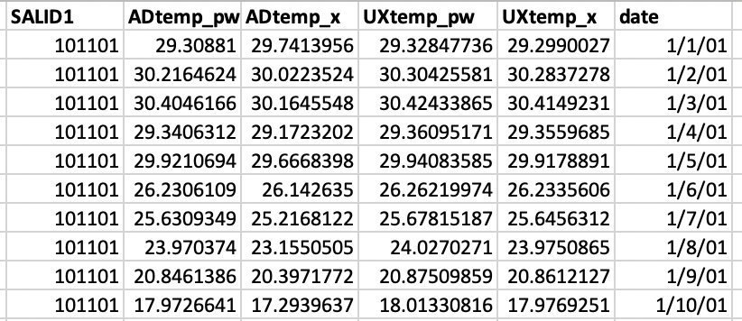
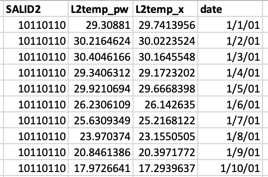

# Daily mean temperature data - ERA5Land
## Sample of 371 Latin American Cities from 2001-2015
### June 24, 2020

Many researchers involved in SALURBAL are interested in using historical temperature reanalysis data. ERA5Land data neglects pixels that have more than 50% water. However, many cities across the world are situated next to the ocean. Since we were losing information, our team interpolated data from ERA5 (at a 30 km x 30 km resolution) and imputed it at the ERA5Land 9km x 9km resolution, filling the gaps from those "missing" pixels.

Once we got the "complete" data for all of our 371 cities, we decided to estimate temperatures at an AD (level 2) level. In order to get temperature data at the AD city level, we weight the temperature pixels by population data (using 100m x 100m WorldPop data for 2010).

Note: Since population data is not as accurate for Panama and Peru, we weight temperature by urban footprint data instead for cities in those countries.

### Access to raw data:
- [ERA5 hourly data on single levels](https://cds.climate.copernicus.eu/cdsapp#!/dataset/reanalysis-era5-single-levels?tab=overview)
- [WorldPop data](https://www.worldpop.org/project/categories?id=3)
- [Global Urban Footprint data](https://drive.google.com/drive/folders/1_NM6c_SDAqb0LAOXt8LpbTT7eIL3HgAY)

### Access to imputed data:
- [ERA5Land imputed data](https://drive.google.com/drive/folders/1EwfXOAIxosSN-sEHMJud5dEew1_WZf9I)

### Access to final data:
- [L1 AD and UX data](https://drive.google.com/drive/folders/1WSVRRjHhRy69CkO0wKkngH98imQlmrmk)
- [L2 data](https://drive.google.com/drive/folders/1P5r1Xu7-SGmCrrlagI2vrgV7e-au-oOT)

---

## Data Imputation

To impute the missing values, we built the following model for each day and geography (L1AD) with missing ERA5land pixels: 

where:
-  is a vector including resampled ERA5 temperature from 31 km resolution to 9 km resolution with cubic resampling, absolute elevation (9 km resolution), relative elevation (elevation difference of a 9 by 9 km pixel and its surroundings), and aspect (9 km resolution);  
-  is a function that uses X to regress ERA5land temperature. Here we used random forest regression.  
-  is the residual, or , which we further modeled with kriging spatial interpolation.  

We ran this model by each day and each geographic unit (L1AD) containing missing ERA5 missing pixels. In each geographic unit, we included all ERA5land pixels and pixels within a 15-pixel buffer from the boundary to have enough samples to build the model above. To avoid overfitting, we used cross-validation to tune the parameters for both random forest regression and kriging spatial interpolation. Finally, we used the resulting model to impute the missing values.  

**Note**: In two cases we did not include kriging spatial interpolation in the imputation:
1. If adding kriging spatial interpolation led to worse model fit when compared with using random forest regression alone, in where we had both ERA5 and ERA5land coverage;
2. If kriging spatial interpolation produced large values, which we seldomly found for the missing pixels. We decided the threshold to be 1 degree in absolute value. We chose this threshold as we observed the model residuals from using random forest alone were less than 1. Since kriging spatial interpolation was meant to further reduce these residuals, we considered kriging values greater than 1 to be anomalies and thus abandoned. 

## Applying the weights on the imputed data 
1. Create a vector from the temperature raster (in 9km x 9km cells). 
2. Import the vector and the AD boundaries into Google Earth Engine (GEE).
3. Process WorldPop and GUF data in GEE, estimating the number of people and built environment by the 9km x 9km.
4. Export the 9km x 9km pixels with population and built environment data into R.
5. Carry out the population weight: Since both the temperature, population, and Global Urban Footprint data are at the same resolution, we can carry out the estimation. Raster extraction using the *velox* library was significantly faster for processing the data. Data processing in the [scripts](https://github.com/ifarah/salurbal_heat/tree/master/scripts) folder.   
6. Paste together files with [paste.R](https://github.com/ifarah/salurbal_heat/blob/master/scripts/paste_v2.R)

**Notes**:  
- The final tables are L1_ADUX_2001_2015.csv, **L1_ADUX_wp_2001_2015_v3.csv**, **L2_2001_2015_v3.csv**, and **L2_wp_2001_2015_v3.csv**. The files containing "wp" have population weighted temperature means for all cities including Panama and Peru. **L1_ADUX_2001_2015_v3.csv** and **L2_2001_2015_v3.csv** have population weighted temperature means for all cities except Panama and Peru that have GUF weighted temperature means for cities in those countries.  
- To make the data processing faster, download the [RData files](https://drive.google.com/drive/folders/1GSB6qLZN1eJo2-tNh7gWSReZgAo6p8gk) for L1 or L2.  
- Make sure to run the processes differently for leap years. Leap years (2004, 2008, and 2012) are processed using 366 instead of 365 days in a year within the loop.

---

**Codebook for L1:**  
- SALID1: City ID. (6 digits)
- ADtemp_pw: Population weighted temperature mean at L1AD level. 
- ADtemp_x: Unweighted temperature mean at L1AD level. 
- UXtemp_pw:Population weighted temperature mean at L1UXX level. 
- UXtemp_x:  Unweighted temperature mean at L1UX level. 
- date: year-month-day.

Preview *L1_2001_2015_v3.csv*:  

**Codebook for L2:**  
- SALID2: City ID (8 digits). 
- L2temp_pw: Population weighted temperature mean at L2 level. 
- L2temp_x: Unweighted temperature mean at L2 level. 
- date: year-month-day. 

Preview *L2_2001_2015_v3.csv*:  

**Contact:** 
- Yang Ju (yangju90@berkeley.edu)
- Irene Farah (irenef@berkeley.edu)

